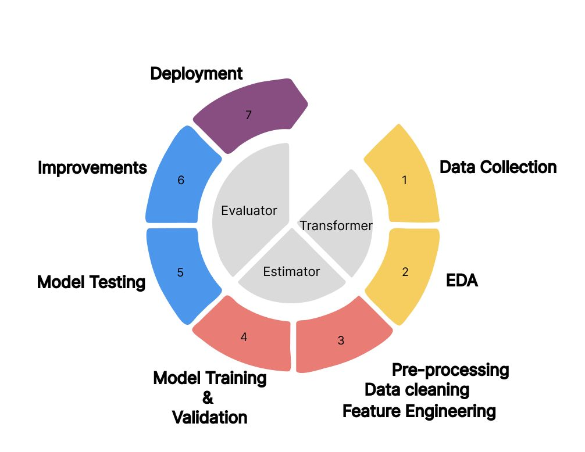
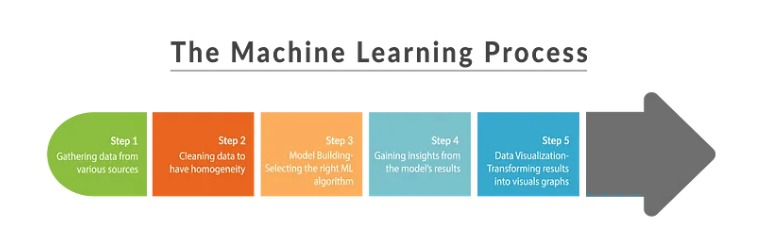
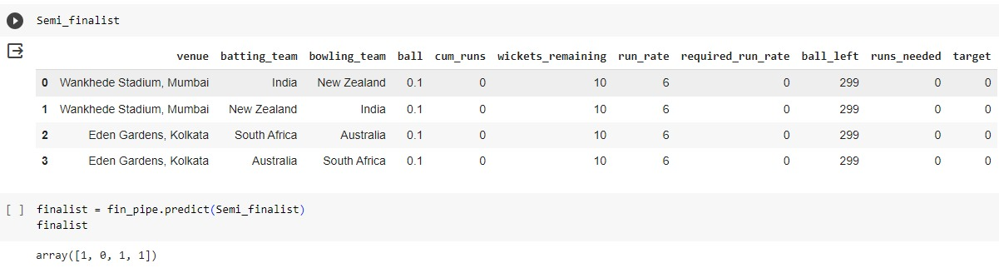

# ICC World Cup 2023 predictions
(Introduction to Data Mining Course Project 3)

In this course project, we strive to employ advanced data mining methods to provide valuable insights for decision-making during the ODI Cricket World Cup 2023. The project focuses on three crucial aspects: assessing the individual performance of players, predicting match scores, and anticipating outcomes for both finals and semifinals. Additionally, our endeavor extends to offering strategic recommendations by predicting the playing XI for teams in the finals, contributing to a comprehensive analysis of the tournament.

## Team 12-Gold Diggers

### Individual Contributions:

| Student ID  |   Name   |     Task      |
|-------------|----------|---------------|
| 202218003 | Rahul Upadhyay   | Deployment, Documentation |
| 202218037 | Muskan Khare     | Predicting Playing XI, Score Predictor, Documentation |
| 202218061 | Jatan Sahu       | Predicting finalists and winner, Score Predictor |
| 202218063 | Bhoomi Prajapati | Predicting Kohli’s Performance, Exploratory Data Analysis |
| 202101201 | Bhargav Vidja    | Exploratory Data Analysis, Flowcharts |

## DATASETS:

The dataset comprises files from kaggle. 

Dataset 1: [ICC Mens World Cup 2023](https://www.kaggle.com/datasets/pardeep19singh/icc-mens-world-cup-2023)

Dataset2: [ODI Men's Cricket Match Data (2002-2023)](https://www.kaggle.com/datasets/utkarshtomar736/odi-mens-cricket-match-data-2002-2023)

### Dataset Description:

* **ODI_Match_Data.csv**

| Column Name           | Description                                                              |
|------------------------|--------------------------------------------------------------------------|
| match_id               | A unique identifier for each ODI cricket match.                          |
| season                 | The season in which the match took place.                                 |
| start_date             | The date on which the match started.                                      |
| venue                  | The stadium or venue where the match was played.                          |
| innings                | The innings number (1st innings or 2nd innings).                          |
| ball                   | A numeric representation of the ball number bowled in the innings.       |
| batting_team           | The name of the batting team for the current innings.                     |
| bowling_team           | The name of the bowling team for the current innings.                     |
| striker                | The batsman who is currently facing the ball.                             |
| non_striker            | The batsman at the non-striker's end.                                     |
| bowler                 | The bowler who is delivering the ball.                                    |
| runs_off_bat           | The number of runs scored off the bat (excluding extras).                |
| extras                | The total number of extra runs (wides, no-balls, byes, leg-byes, penalty) in the current ball. |
| wides                  | The number of wide deliveries bowled in the current ball.                 |
| noballs               | The number of no-ball deliveries bowled in the current ball.              |
| byes                   | The number of byes scored in the current ball.                            |
| legbyes               | The number of leg-byes scored in the current ball.                        |
| penalty               | The number of penalty runs awarded in the current ball.                   |
| wicket_type           | The type of wicket taken in the current ball (e.g., caught, bowled, run out). |
| player_dismissed      | The player who was dismissed in the current ball.                         |
| other_wicket_type     | Additional information about the wicket (if any) in the current ball.    |
| other_player_dismissed| Additional player information related to the wicket (if any) in the current ball. |
| cricsheet_id          | A unique identifier for the match from Cricsheet.                         |

* **ODI_Match_info.csv**

| Column Name      | Description                                                           |
|-------------------------|-----------------------------------------------------------------|
| id                | A unique identifier for each cricket match.                           |
| season            | The season or year in which the match took place.                      |
| city              | The city where the match was held.                                    |
| date              | The date on which the match was played.                               |
| team1             | The name of the first cricket team participating in the match.        |
| team2             | The name of the second cricket team participating in the match.       |
| toss_winner       | The team that won the toss.                                           |
| toss_decision     | The decision made by the toss-winning team (bat or field).            |
| result            | The result of the match (e.g., "normal," "tie," "no result").         |
| dl_applied        | An indicator of whether the Duckworth-Lewis method was applied (1 for applied, 0 for not applied). |
| winner            | The winning team of the match.                                        |
| win_by_runs       | The margin of victory in runs (0 for wickets, if not applicable).    |
| win_by_wickets    | The margin of victory in wickets (0 for runs, if not applicable).    |
| player_of_match   | The player awarded the "Man of the Match" title.                      |
| venue             | The stadium or venue where the match was played.                      |
| umpire1           | The name of the first on-field umpire.                                |
| umpire2           | The name of the second on-field umpire.                               |
| umpire3           | The name of the third umpire (TV umpire).                             |

* **deliveries.csv**

| Column Name          | Description                                               |
|-----------------------|-----------------------------------------------------------|
| match_id              | Unique identifier for each cricket match.                 |
| season                | The specific season in which the cricket match took place.|
| start_date            | The date when the match started.                           |
| venue                 | The location where the cricket match was held.             |
| innings               | The inning number during which the event occurred.        |
| ball                  | The ball number within the inning.                         |
| batting_team          | The team currently batting.                                |
| bowling_team          | The team currently bowling.                                |
| striker               | The batsman facing the current ball.                       |
| non_striker           | The batsman at the non-striker's end.                      |
| bowler                | The player bowling the current ball.                       |
| runs_off_bat          | Runs scored off the bat on the current ball.               |
| extras                | Additional runs scored, not from the bat (e.g., wides, no-balls). |
| wides                 | The number of wide deliveries bowled.                     |
| noballs               | The number of no-ball deliveries bowled.                  |
| byes                  | Runs scored as byes on the current ball.                  |
| legbyes               | Runs scored as leg-byes on the current ball.              |
| penalty               | Penalty runs awarded on the current ball.                 |
| wicket_type           | Type of dismissal if a wicket fell on the current ball.   |
| player_dismissed      | Batsman dismissed on the current ball.                    |
| other_wicket_type     | Additional information about the type of dismissal.       |
| other_player_dismissed| Additional player dismissed on the current ball.          |

* **matches.csv**
  
| Column Name       | Description                                                   |
|-------------------|---------------------------------------------------------------|
| season            | The cricket season in which the match occurred.                |
| team1             | The first team participating in the match.                      |
| team2             | The second team participating in the match.                     |
| date              | The date on which the match took place.                         |
| match_number      | Unique identifier for the match in the season.                  |
| venue             | The stadium or ground where the match was held.                 |
| city              | The city where the match was played.                            |
| toss_winner       | The team winning the toss.                                      |
| toss_decision     | Decision taken by the toss-winning team (batting or bowling).  |
| player_of_match   | The outstanding player of the match.                            |
| umpire1           | The first on-field umpire for the match.                        |
| umpire2           | The second on-field umpire for the match.                       |
| reserve_umpire    | The reserve umpire designated for the match.                    |
| match_referee     | The official responsible for overseeing the match.              |
| winner            | The team that emerged victorious in the match.                 |
| winner_runs       | The margin of victory in terms of runs.                         |
| winner_wickets    | The number of wickets by which the winning team achieved victory.|
| match_type        | The type of cricket match (e.g., Test, One Day International, T20).|

* **points_table.csv**
  
| Column Name | Description                                                     |
|-------------|-----------------------------------------------------------------|
| Ranking     | The position or order of the team in the current standings.     |
| Team        | The name of the cricket team.                                    |
| Matches     | Total number of matches played by the team.                     |
| Won         | Number of matches won by the team.                              |
| Lost        | Number of matches lost by the team.                             |
| Tie         | Number of matches that ended in a tie for the team.             |
| No Results  | Number of matches with no result for the team.                  |
| Points      | Total points accumulated by the team in the ranking.            |
| Net Run Rate| The net run rate calculated for the team.                       |
| Series Form | Performance trend of the team in recent series.                 |
| Next Match  | Details of the team's upcoming match.                           |
| For         | Total runs scored by the team in all matches.                   |
| Against     | Total runs conceded by the team in all matches.                 |

## Workflow

### Exploratory Data Analysis

## Insights

*  MA Chidambaram Stadium is the venue where most balls are played.
  
* South Africa faced the most balls among all the batting teams.
  
* Virat Kohli is the player who faced the most balls among all the players.
  
* India is the team that played the most matches.
  
* The majority of the matches were won by the team that batted first.
  
* The most common result of the matches was that the team that batted first won by a certain number of runs.

## FUNCTIONALITIES

## TASK 1:

### Score Projection Engine

*  **Objective:** The primary aim is to develop a Score Projection Engine for predicting overall team scores in the ICC Cricket World Cup 2023.

*  **Data Source:**  Utilizes extensive match data, including historical scores and team performance, to construct a robust dataset.(ODI_match_data.csv)

*  **Approach:**  Implements advanced machine learning techniques to analyze past match outcomes and create a predictive model for projecting team scores.

*  **ML techniques:** 

*  **Predictive Feature:**  Focuses on various factors influencing team scores, such as teams, venue, historical performance etc.

*  **Outcome:**  Offers score projections, enabling stakeholders to anticipate and strategize based on expected team performances in the World Cup 2023.
  
### Kohli's Run Oracle

* **Objective:** The primary goal is to predict the total runs scored by Virat Kohli in the ICC Cricket World Cup 2023.

* **Data Source:** Utilizes ball-by-ball data from previous matches in the World Cup 2023 to build a comprehensive dataset.(deliveries.csv, matches.csv, points_table.csv)

* **Approach:**  Employs machine learning techniques to analyze historical performance data and create a predictive model for Virat Kohli’'s batting performance.
 
* **ML techniques:**  Utilizing a diverse set of regression models, including Linear Regression, Random Forest Regressor, XGBoost Regressor, and MLP Regressor, with an added layer of optimization through hyperparameter tuning via GridSearchCV.

* **Predictive Feature:**  The model focuses on forecasting runs(total_runs) based on the specific number of deliveries faced by Virat Kohli.

* **Outcome:**  Provides insights and predictions that can contribute to a better understanding of Virat Kohli's expected performance in the World Cup 2023.
(result screenshot)

## TASK 2 and 3:

### Outcome Forecast: Anticipate the Winners

### Outcome Forecast: Anticipate the Winners

*  **Objective:**It can be used as a dynamic model. We can predict match winners in the ICC Cricket World Cup 2023.

*  **Data Source:** We have used two datasets "delivery.csv" and "matches.csv"

*  **Approach:** Employs advanced machine learning algorithms to analyze historical patterns and discern factors contributing to match victories.

*  **ML Techniques:** We have used different classifier and tune model using hyperparameters examples Gradientboosting, XGBoost, CatBoost, LGBMClassifier, DNN with different hyperparameters. 

*  **Predictive Feature:**  Considers various variables, including team composition, player form, and past head-to-head performances, to predict match outcomes accurately.

*  

*  **Outcome:** Provides valuable insights and predictions on potential match winners, assisting cricket enthusiasts, analysts, and strategists in making informed decisions during the World Cup 2023.
(result screenshot)

### XI Projection: Forecasting the Playing Squad

*  **Objective:**  The central goal is to facilitate teams in making well-informed decisions regarding the composition of their playing eleven for the final match of the ICC Cricket World Cup 2023.

*  **Data Source:**  Utilizes extensive player data spanning since 2002, incorporating batting and bowling performances to create a comprehensive model.

*  **Approach:**  Employs advanced analytics to calculate batting and bowling ratings, enabling the selection of the top 6 batsmen and top 5 bowlers for each team based on their historical performances.

*  **ML Techniques:** 

*  **Predictive Feature:**  Considers individual player statistics and historical trends to predict the optimal playing eleven, providing a strategic edge in the crucial final match.
(result screenshot)
*  **Outcome:**  Aids teams in strategic decision-making, offering valuable insights into player performances and contributing to the development of an optimal playing eleven for the World Cup 2023 final.

